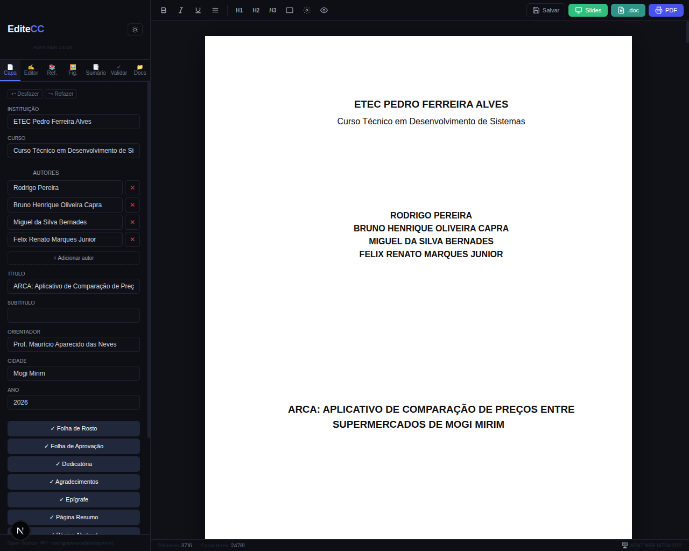
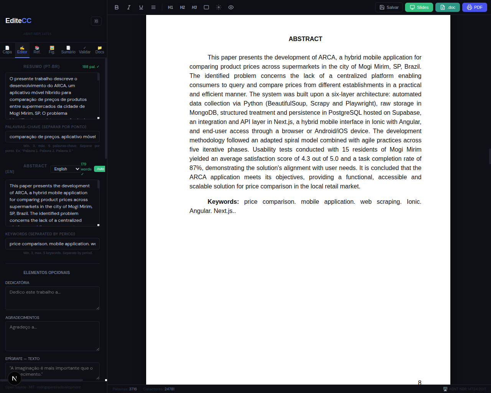

# EditeCC ✏️


---

**Editor de textos acadêmicos com formatação ABNT automática.**

> **Versão atual: v1.0.1** — [Baixar](https://github.com/rodrigopereiradevelopment/editecc/releases/tag/v1.0.1) | [Versão Web](https://editecc.vercel.app)

---

## Por que o EditeCC?

Estudantes brasileiros gastam **horas** formatando TCCs, monografias e artigos acadêmicos conforme as normas ABNT. O EditeCC resolve isso: você **escreve**, e a formatação fica por nossa conta.

- ✅ **IA totalmente offline** — tradução e sumarização sem internet
- ✅ **Não envia seus documentos para servidores** — tudo fica no seu computador
- ✅ **Desktop multiplataforma** — Windows, Linux e macOS
- ✅ **Open Source** — MIT, use e modifique livremente

---

## Screenshots

### Capa automática


### Abstract e Resumo


---

## ✨ Funcionalidades

- 📄 **Folha A4** simulada com margens ABNT (3cm esq/sup, 2cm dir/inf)
- 🎨 **Editor rico com Tiptap** — Negrito, Itálico, Sublinhado, Justificar, Títulos H1/H2/H3
- 📋 **Capa automática** — gerada em tempo real conforme você preenche o formulário
- 📃 **Folha de Rosto, Folha de Aprovação** — elementos pré-textuais obrigatórios
- 📖 **Dedicatória, Agradecimentos, Epígrafe** — elementos pré-textuais opcionais
- 📝 **Resumo + Abstract** — campos dedicados com contador de palavras
- 🌐 **Tradução automática** — resumo pt→en/es/fr/de/it, 100% local (NLLB-200)
- 📑 **Sumário automático** a partir dos headings do documento
- 📚 **Gerador de referências** — DOI, ISBN, BibTeX → ABNT NBR 6023
- 🖼️ **Lista de Figuras e Tabelas automática**
- 📄 **Anexos, Apêndices, Glossário** — elementos pós-textuais
- 📖 **Glossário semi-automático** — TF-IDF detecta termos do texto
- 📝 **Notas de Rodapé** — gerenciador com inserção de marcadores
- 📽️ **Gerador de Slides** — sumarização TF-IDF offline, geração `.pptx`
- 🔍 **Tamanho da interface ajustável** — 4 níveis (P/M/G/XG)
- ♿ **Acessibilidade WCAG 2.2**
- 💡 **Tema claro/escuro**
- ✅ **Validador ABNT** — hierarquia, numeração, itálico em obras
- 📁 **Múltiplos documentos** — importe/exporte `.editecc`
- 💾 **Autosave** a cada 20 segundos
- 📤 **Exportar PDF** — impressão nativa com margens ABNT
- 📝 **Exportar RTF** — compatível com Word, LibreOffice e Google Docs
- 🖥️ **App desktop** — Windows (.exe), Linux (.deb, .AppImage, .rpm), macOS (.dmg)

---

## 🗺️ Roadmap

| Versão | Status | Funcionalidades |
|--------|--------|----------------|
| **v1.0.0** | ✅ Concluído | **Lançamento oficial** — apps desktop (Win/Linux/Mac), landing, release pública |
| **v1.0.1** | ✅ Concluído | Corrigir referências, glossário semi-automático, fix sumário overflow |
| **v1.1** | 🔜 Próximo | Galeria de screenshots, seção "Quem fez", GIF do editor |
| **v1.2** | 📋 Planejado | Personalização de slides (temas, cores, logo) |
| **v2.0** | 📋 Planejado | Exportação DOCX, IA local, colaboração em tempo real |

---

## 🚀 Como usar

### Versão Web

Acesse direto no navegador: **[editecc.vercel.app](https://editecc.vercel.app)**

### Download Desktop

Baixe na página de [releases](https://github.com/rodrigopereiradevelopment/editecc/releases/tag/v1.0.1):

| Sistema | Arquivo |
|---------|---------|
| Windows | `EditeCC_1.0.1_x64-setup.exe` |
| Linux (Ubuntu/Debian) | `EditeCC_1.0.1_amd64.deb` |
| Linux (Fedora/RHEL) | `EditeCC-1.0.1-1.x86_64.rpm` |
| Linux (AppImage) | `EditeCC_1.0.1_amd64.AppImage` |
| macOS (Apple Silicon) | `EditeCC_1.0.1_aarch64.dmg` |

### Desenvolvimento

```bash
git clone https://github.com/rodrigopereiradevelopment/editecc.git
cd editecc
npm install --legacy-peer-deps
npm run dev
```

---

## 🏗️ Arquitetura

| Camada | Tecnologia |
|--------|-----------|
| Framework | Next.js 16 (App Router) |
| Editor | Tiptap v3 + ProseMirror |
| Persistência | localStorage / IndexedDB |
| Desktop | Tauri v2 (Rust) |
| Referências | Citation.js |
| Tradução | Transformers.js (NLLB-200, 100% local) |

---

## 📐 Padrão ABNT

| Elemento | Configuração |
|----------|-------------|
| Margens | 3cm (sup/esq), 2cm (inf/dir) |
| Fonte | Arial 12pt |
| Espaçamento | 1,5 entre linhas |
| Recuo | 2,5cm na primeira linha |

---

## 🤝 Contribuindo

Veja o [CONTRIBUTING.md](CONTRIBUTING.md) com instruções completas de setup, padrões, testes e PR checklist.

---

## 📄 Licença

MIT — use, modifique e distribua livremente.

---

*Feito com ☕ para os estudantes da ETEC e de todo o Brasil.*
